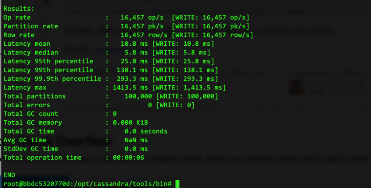
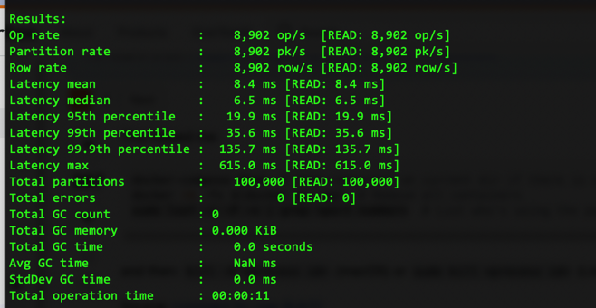

1) Докер был развернут на локальной машине ранее
2) Развернул в кластерном режиме 3 инстанса Cassandra с помощью docker-compose (файл в этой же директории)
3) Создал keyspace(keyspace_test_claster) и 2 таблицы (books,races) , в т.ч. с составным partition key, доп. полем (rating,cyclist_name, rank ) не входящим в primary key
4) Заполнил обе таблицы по 1000 строк, сделал простой генератор на python для этого (в приложенных файлах)
5) Выполнил несколько вариантов запросов, оставли комментарии
6) Сделал вторичный индекс и выполнил по нему запрос (все команды в приложенном файле cassandra.sql)

* Задание со звездочкой. Нагрузить кластер при помощи Cassandra Stress Tool

Зашел в контейнер одного из инстансов
Выполнил
1  cd /opt/cassandra/tools/bin
2  ./cassandra-stress write n=500000
3  ./cassandra-stress write n=400000
4  ./cassandra-stress write n=100000
5  ./cassandra-stress read n=100000

Результаты:

Сложности с которыми столкнулся:
1) файла статьи для нагрузки нет, пришлось искать в интернете статью (открылась только через vpn)
2) Просто так cassandra-stress - command not found в контейнере, пришлось искать по файлам /opt/cassandra/tools/bin
3) При выполении 500_000 и более вставок (как пример в статье) - контейнеры падали поочередно (видимо из-за нехватки ресурсов), и нагрузочный тест не мог пройти.