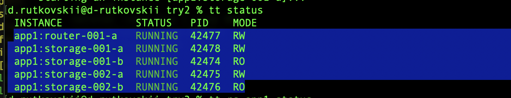

# Домашнее задание по теме: работа с tarantool

Описание/Пошаговая инструкция выполнения домашнего задания:
Установить Tarantool Cartridge CLI
Создать шаблон приложения командой:
cartridge create --name myapp
Собрать и запустить приложение:
cartridge build
cartridge start
Задать любую топологию кластера в UI и сделать bootstrap

Часть 1 MacOs:  

1. brew install cartridge-cli
2. cartridge create --name myapp
3. cartridge build
4. Упал с ошибкой Missed required binaries tarantoolctl
5. Не нашел описание ошибки и через brew tarantoolctl не находился

Часть 2 Попытки запустить в контейнере: 

1. Согласно документации попробовал запустить контейнер
docker run -p 3301:3301 -p 8081:8081 tarantool/getting-started
Не запустился на Apple M3 c ошибкой WARNING: The requested image's platform (linux/amd64) does not match the detected host platform (linux/arm64/v8) and no specific platform was requested

2. Попробовал взять базовые образы в конетйнерах с alpine, centOs, Ubuntu, Debian  - на всех образах не смог скачать пакет cartridge-cli. Попробовал собрать пакет из исходников - удалось только на Debian но дальше сборки дело не пошло 

Часть 3, снова MacOs

1. Продолжил поиски информации и обнаружил что 
https://www.tarantool.io/en/doc/latest/tooling/tt_cli/cartridge/

Important
The Tarantool Cartridge framework is deprecated and is not compatible with Tarantool 3.0 and later. This command is added for backward compatibility with earlier versions.

Причем он в таком статусе уже с конца 2023 года

2. установил tt  попробовал запуститься - заругался на  cmake

3. установил brew install cmake
4. Команда tt start отработала, но при просмотре tt status показало что кластер не запущен
4. Попробовал скачать тестовый проект предлагаемый в офф документации и проделать с ним те же действия - не принесло результата
5. попробовал создать новый проект и проделать с ним все действия с tt без участия cartrige-cli - и о чудо, проект собрался. 
Последовательность комманд: \
tt init\
tt create vshard_cluster --name app1 \
tt build app1 \
tt start app1 \
Проверка статуса: tt status, показала что все инстансы запущенны

6. Пошел в webUI и не обнаружил его. Пошел мониторить информацию  и если правильно понял - его теперь нет в community edition

Выводы которые сделал для себя:
1) Никто не проверял корректность и актуальность ДЗ уже минимум 10 месяцев, после выхода 3.x версии tarantool
2) В обучении ни в одном материале нет информации о том как его выполнить.
3) Научило оно меня примерно следующему: ничему.

